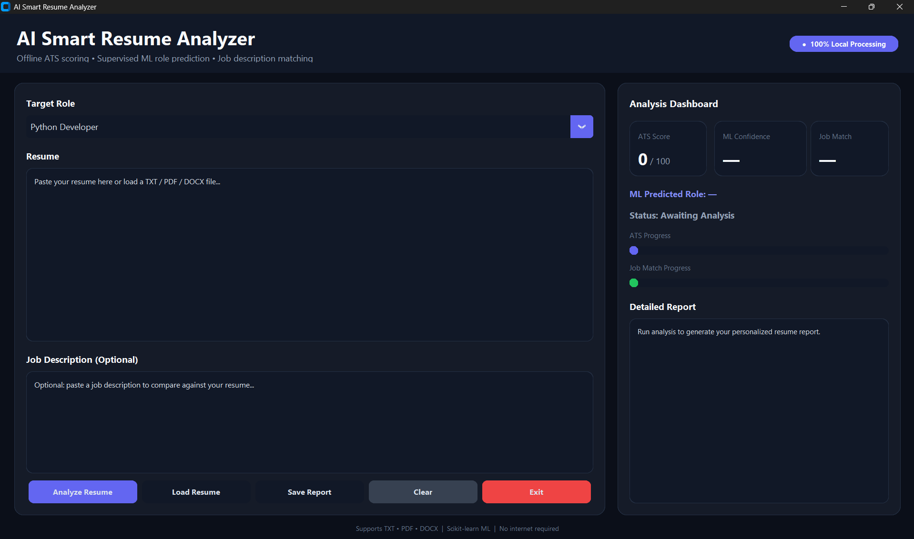

# AI Smart Resume Analyzer

An AI-powered desktop application built using **Python** and **Machine Learning** to analyze resumes, calculate ATS scores, predict suitable job roles, compare resumes with job descriptions, and provide intelligent suggestions for improvement.

## Features

- ATS Resume Score Analysis
- Machine Learning-Based Job Role Prediction
- Resume & Job Description Matching
- Skill Gap Analysis
- AI-Powered Resume Improvement Suggestions
- Support for PDF, DOCX, and TXT resumes
- Modern Desktop GUI built with CustomTkinter

## Tech Stack

- Python
- Scikit-learn
- TF-IDF
- Multinomial Naive Bayes
- CustomTkinter
- PDFPlumber
- python-docx

## Machine Learning

This project uses **TF-IDF Vectorization** with a **Multinomial Naive Bayes** classifier to predict the most suitable job role based on resume content. It also combines ATS scoring and resume analysis techniques to provide meaningful feedback.

## Project Preview

### Home Screen



## Installation

```bash
pip install -r requirements.txt
python main.py
```

## Future Improvements

- Deep Learning based Resume Classification
- Cloud Deployment
- Multi-language Resume Support
- Resume Ranking System
- Recruiter Dashboard

## Author

**Umme Ruman**

BS Artificial Intelligence Student
